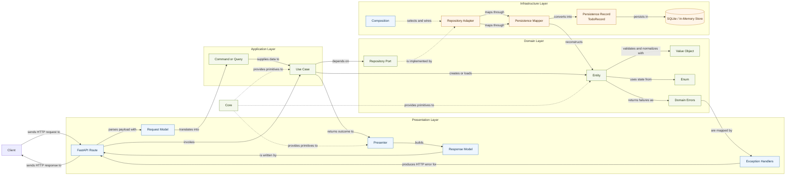

# Backend Context

This document explains the architectural layers and domain-driven design terms used in the backend. It is intentionally general: it describes how the backend is meant to be structured, what each layer is responsible for, and what each layer must avoid doing.

## Layered Structure

The backend is organized around inward-facing dependency direction.

- `app.core` contains core concepts used across the backend.
- `app.presentation` contains transport-facing concerns such as HTTP schemas and exception handling.
- `app.infrastructure` contains framework-backed adapters such as database support.
- `app.todos` is a feature slice with its own application, domain, infrastructure, and presentation modules.

The main rule is: outer layers may depend on inner layers, but inner layers must not depend on outer layers.

## Layer Responsibilities

### Core

Location:

- `app/core`

What it does:

- Defines shared primitives that are still domain-oriented.
- Provides reusable building blocks such as `Result`, `DomainError`, and `DomainModel`.
- Supports multiple feature slices without becoming a general dumping ground.

What it should not do:

- It should not own HTTP schemas.
- It should not own database sessions, ORM records, or framework adapters.
- It should not become a miscellaneous utilities folder.

### Domain Layer

Location:

- `app/todos/domain`

What it does:

- Encodes business concepts and invariants.
- Defines entities, value objects, domain enums, domain errors, and repository ports.
- Protects the meaning of the model independently of transport and persistence.

What it should not do:

- It should not know about FastAPI, SQLAlchemy, HTTP requests, or response models.
- It should not instantiate infrastructure adapters.
- It should not contain transport mapping or persistence mapping code.

### Application Layer

Location:

- `app/todos/application`

What it does:

- Orchestrates use cases.
- Accepts explicit application inputs such as commands and queries.
- Coordinates domain objects and repository ports.
- Defines the application seam that presentation calls into.

What it should not do:

- It should not contain HTTP-specific models or status-code decisions.
- It should not depend on concrete repositories.
- It should not contain ORM records or SQLAlchemy session logic.

### Presentation Layer

Location:

- `app/presentation`
- `app/todos/presentation`

What it does:

- Owns transport-facing models and behavior.
- Converts requests into application inputs.
- Converts application results into HTTP responses.
- Maps domain errors into transport-visible behavior.

What it should not do:

- It should not contain business invariants.
- It should not directly persist domain objects.
- It should not reach through multiple layers of domain internals when a presentation adapter can own the translation.

### Infrastructure Layer

Location:

- `app/infrastructure`
- `app/todos/infrastructure`

What it does:

- Implements ports declared by inner layers.
- Owns database sessions, ORM models, repository adapters, and persistence mappers.
- Wires framework-backed behavior behind explicit seams.

What it should not do:

- It should not define business rules that belong in the domain.
- It should not decide HTTP behavior.
- It should not be called directly by handlers when the application seam already exists.

## Dependency Direction

The intended flow for a request is:

1. Presentation accepts transport input.
2. Presentation translates that input into an application command or query.
3. Application coordinates the use case through domain objects and ports.
4. Infrastructure adapters implement the required ports.
5. Presentation translates the result back into a transport response.

This means:

- Presentation depends on application.
- Application depends on domain and ports.
- Infrastructure depends on domain and application contracts.
- Domain depends only on core concepts.

## Data Flow Diagram

The diagram below shows the main runtime flow for a todo request. It emphasizes two things:

- data moves from transport input toward the domain model and then back to transport output
- dependencies still point inward, even when runtime calls move across outer adapters

Reading the diagram from left to right:

1. A client request enters the presentation layer through a FastAPI route.
2. Presentation converts raw transport data into an application input model.
3. The use case coordinates the workflow through domain concepts and the repository port.
4. A concrete infrastructure adapter fulfills that port and persists or loads data.
5. The application result is translated by the presenter into a response model.
6. Domain failures are mapped by presentation into HTTP-visible behavior.

## DDD Terms In This Codebase

### Entity

An entity is a domain object with identity that persists through state changes.

Current example:

- `TodoEntity`

`TodoEntity` is the central todo domain object. It has a stable id and owns the concept of a todo item.

### Value Object

A value object is defined by its value and invariants rather than identity.

Current example:

- `TodoTitle`

`TodoTitle` normalizes and validates title input. It exists to protect the meaning of a todo title.

### Domain Enum

A domain enum represents a constrained set of domain states or categories.

Current example:

- `TodoStatus`

`TodoStatus` models the allowed lifecycle states for a todo item.

### Domain Error

A domain error represents a business-level failure without depending on transport concerns.

Current examples:

- `EmptyTodoTitleError`
- `TodoNotFoundError`

These errors are raised or returned in domain and application flows, then mapped into HTTP behavior by presentation.

### Repository Port

A repository port is an inward-facing interface that the application uses to load or persist domain objects.

Current example:

- `TodoRepositoryPort`

The port belongs to the inner model. Infrastructure adapters satisfy it.

### Use Case

A use case is an application workflow that expresses one business action from the system's point of view.

Current examples:

- `CreateTodoUseCase`
- `GetTodoUseCase`

Use cases coordinate domain objects and repository ports. They do not own HTTP concerns or direct infrastructure details.

### Command

A command is an application input model that captures the intent to change state.

Current example:

- `CreateTodoCommand`

Commands belong to the application layer, not the presentation layer.

### Query

A query is an application input model that captures the intent to read state.

Current example:

- `GetTodoQuery`

Queries provide a stable, explicit application interface instead of raw primitive parameters.

### Presenter

A presenter is a presentation adapter that translates application outcomes into transport-facing results.

Current example:

- `TodoPresenter`

The presenter keeps route handlers thin and prevents HTTP code from knowing too much about domain internals.

### Persistence Record

A persistence record is the infrastructure shape used to store data in the database.

Current example:

- `TodoRecord`

The persistence record should remain a storage structure, not a mixed storage-and-domain-mapping type.

### Persistence Mapper

A persistence mapper translates between domain objects and persistence records.

Current example:

- `TodoRecordMapper`

This mapping belongs in infrastructure, because it is part of the persistence adapter.

### Repository Adapter

A repository adapter is a concrete infrastructure implementation of a repository port.

Current examples:

- `SqliteTodoRepository`
- `InMemoryTodoRepository`

The application depends on the port; composition selects the adapter.

## Terms Specific To Current Composition

### TodoRepositoryType

`TodoRepositoryType` is the feature-owned enum that selects which repository adapter is used at composition time.

### Composition

Composition is where concrete adapters are selected and wired together.

Current example:

- `app/todos/presentation/dependencies/todo_dependencies.py`

Composition is allowed to know about concrete adapters. Use cases and entities are not.

## Practical Rules For Future Changes

When adding or changing behavior:

- Put invariants in the domain layer.
- Put use-case orchestration in the application layer.
- Put HTTP translation in the presentation layer.
- Put persistence translation and concrete adapters in infrastructure.
- Prefer ports for inward-facing contracts and adapters for outward-facing implementations.
- Prefer commands and queries when a use case has a meaningful application input.

When unsure where code belongs, ask two questions:

1. Is this business meaning, transport meaning, or framework meaning?
2. Does this code make an inner layer depend on an outer one?

If the answer to the second question is yes, the code is probably in the wrong place.
